# Segregation of Duties Controls

## Concept

Segregation of Duties (SoD) is a risk management principle that ensures no single individual has control over all steps of a critical process, thereby preventing errors and reducing the risk of fraud.

### Different types of SoD

SoD rules can be defined for any critical business process, such as:

- Accounting and Finance
    - Procure-to-Pay 
    - Order-to-Cash 
    - Record-to-Report 
    - Inventory Management 
    - Treasury & Cash Management 
    - Payroll & HR 
    - Fixed Assets 
- Trading and Asset Management
    - Separation of Front Office, Middle Office, and Back Office duties 
    - Separation of IT/maintenance and business duties 
- IT
    - Separation of Development and Production duties
    - Separation of admin rights and other high-privilege access (backup, DBA, user access management…) 
    - Change management / CI/CD

## SoD in Identity Analytics

There are two major ways to configure SoD in IDA: either by creating custom controls for each SoD rule you want to implement or by using the SoD matrix data collection process.

### Pros and cons

These two ways of implementing SoD each have pros and cons.

Implementing SoD using custom controls is more time-consuming and requires the creation of a single control for each rule. However, this allows for more flexibility and complexity in each rule configuration.

Implementing SoD with an embedded matrix provides a standardized way of loading rules, hence less flexibility and complexity. However, it makes the process faster and allows it to be used quickly out of the box.

Regardless of the complexity of the SoD rules to be implemented in the project, effort will be required to define those rules.

### Custom control

There are three ways to build custom SoD controls.

> [!Warning] Controls configured this way are not considered SoD controls by the product. Therefore, they will not be available on the SoD pages.

1) **Deprecated:** SoD control between two single permissions. This type of control returns the identities or accounts in discrepancy because they have access to both permissions at the same time. The use of the SoD matrix is recommended instead, as these controls are not displayed OOTB in the latest version of the IAP portal.  
   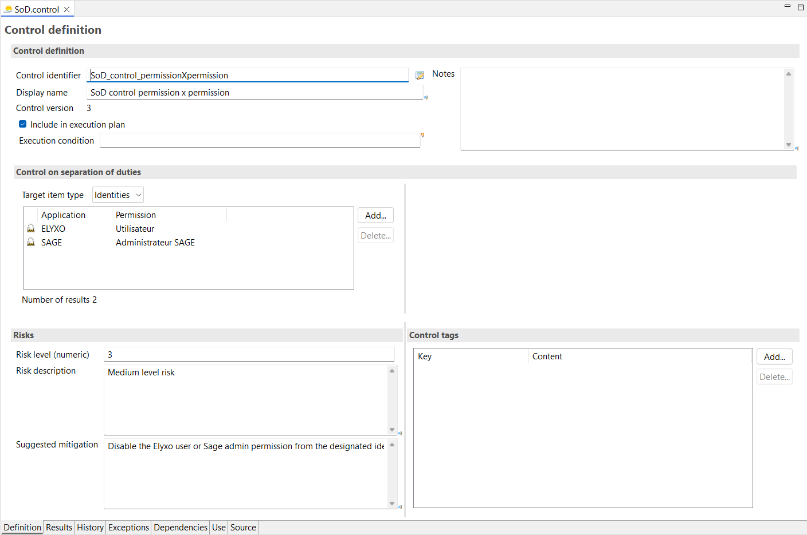

2) **Deprecated:** SoD control between two sets of permissions. This type of control returns the identities or accounts in discrepancy because they have access to at least one permission in the first set and one in the second set at the same time. The use of the SoD matrix along with business activities is recommended instead, as these controls are not displayed OOTB in the latest version of the IAP portal.  
   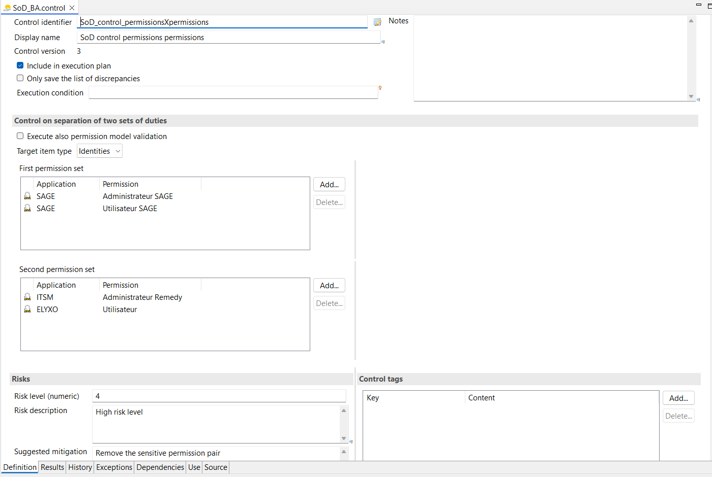

3) The third approach consists of using a custom rule for the control, which provides significantly more flexibility and complexity.

   In the example below, we want to identify identities that:
   - have access to the permissions "Utilisateur" and "Valideur3",
   - do not have access to the permission "Valideur2",
   - and have access to either the "Administrateur Remedy" or the "Administrateur SAGE" permission.

   Logical operation:  
   `Utilisateur AND Valideur3 AND NOT Valideur2 AND (Administrateur Remedy OR Administrateur SAGE)`

   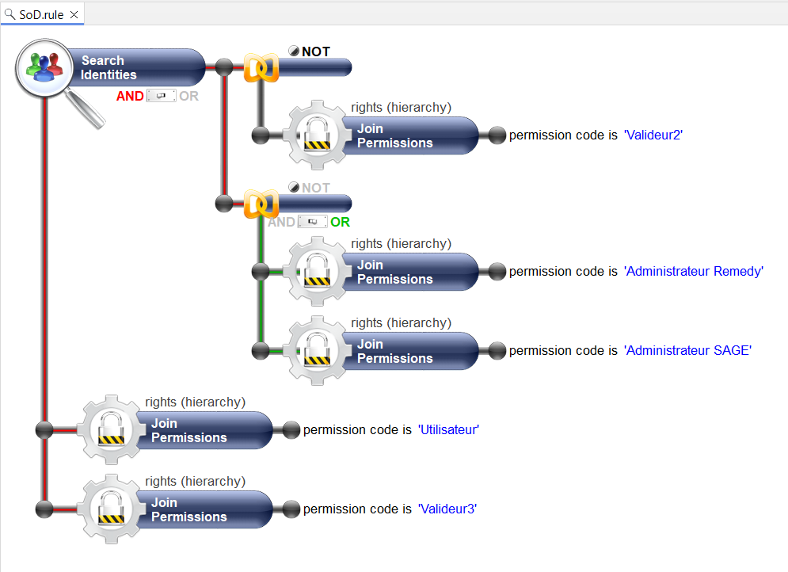

   This rule can then be used in a control, and the returned identities will have SoD defects.

### SoD matrix

SoD matrices are objects embedded in the product. Their purpose is to generate multiple SoD controls automatically during an execution plan. The controls covered by a matrix are the same as those defined in parts 1 and 2 in [Custom control](#custom-control).

A matrix is identified by a code and a display name, as well as optional tags including a type and a list of nine custom fields.

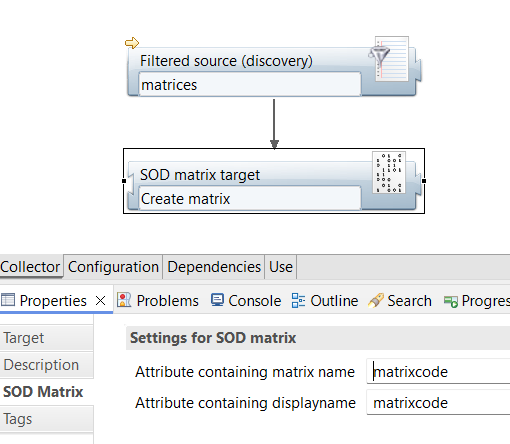

Once created, a matrix is an empty shell, and several pairs of toxic permissions must be added to it. Each toxic pair will be computed as an SoD control during the execution plan. These pairs can either be between two permissions or between two sets of permissions. In the latter case, those permission sets must be loaded into business activities beforehand.

#### SoD matrix permission pair

Permission pairs are built based on two application/permission pairs, a unique control identifier, and the code of a matrix created in a previous step.

The `Result type` option determines whether the control processes results at the identity level or the account level.

- On the account level, a discrepancy appears if the account has both permissions.
- On the identity level, a discrepancy appears if the identity has both permissions through one or more accounts.

For permission pairs, `Model validation` should be set to `Permission type validation`.

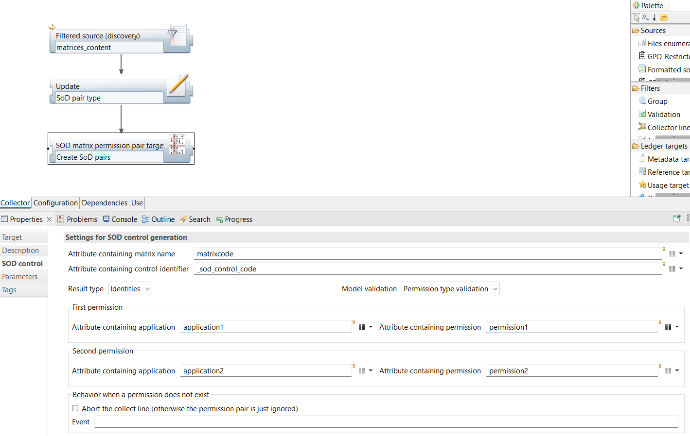

Some optional attributes can be configured on the pair, such as the display name, risk level (integer between 0 and 5), suggested mitigation, etc.

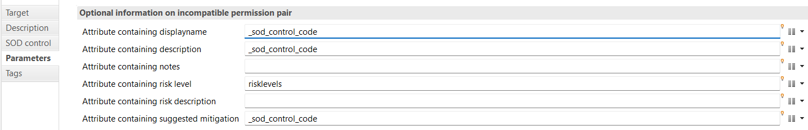

Tags can also be added. For compatibility with SoD pages as of IAP 3.5, the `type` field should be filled with the value "SoD between permissions," and `custom1` should contain the same matrix code as the one defined in the SoD control tab.

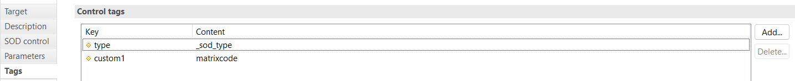

#### SoD matrix business activity pair

Creating a toxic pair based on BAs (Business Activities) can be done in the same way as for standard permissions but requires mandatory preprocessing as well as slight modification of several fields.

It is mandatory to load the BAs along with their permissions with a permission type set to `Activity` before using them as targets in the matrix permission pair. The toxic pair can then be created as explained above, using the identifier of the BA permission.

For BA pairs, `Model validation` should be set to `Activity type validation`.

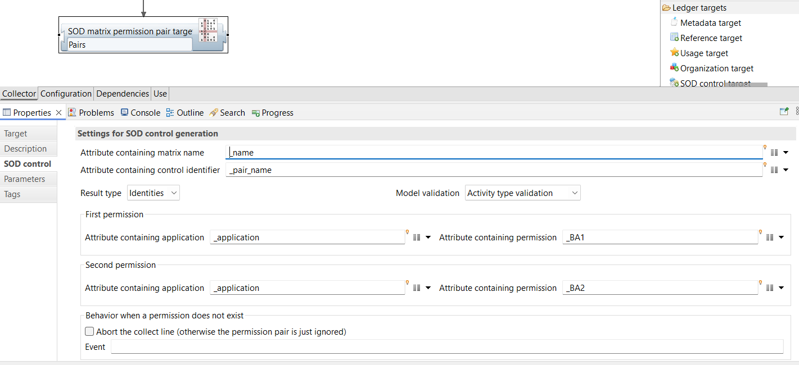

For compatibility with SoD pages as of IAP 3.5, the `type` field should be filled with the value "SoD between activities," and `custom1` should contain the same matrix code as the one defined in the SoD control tab.

## SoD Designer

The SoD Designer is a webpage available in the IAP portal intended to help users build their SoD matrices. It provides an interface to select toxic permission pairs that can be added to a defined matrix along with a risk level assigned to each pair.

This "SoD - Designer" page is available to functional admins and technical admins through the Controls menu. The SoD license feature is required to access this interface.

### Create a matrix

From this page, the user must select two lists of applications. The permissions contained in those applications will then be displayed and can be used to populate an SoD matrix.

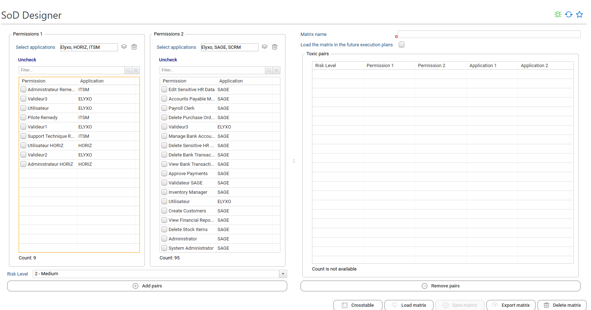

The user can select one or more permissions in each list along with a risk level below, then press the "Add pairs" button to create the list of toxic pairs that will be added to the list on the right with the selected risk level.

If two permissions are selected in the first list and three in the second, six toxic pairs will be created (2×3). A permission cannot be toxic with itself, and pairs can span across applications.

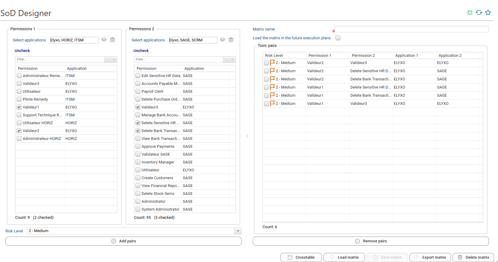

If toxic pairs need to be removed, they can be selected and removed using the "Remove pairs" button.

In case of an incorrect risk level, the pair should be selected again in both lists on the left along with the new risk level and added again. The previous pair will be overwritten by the new one, correcting the risk level.

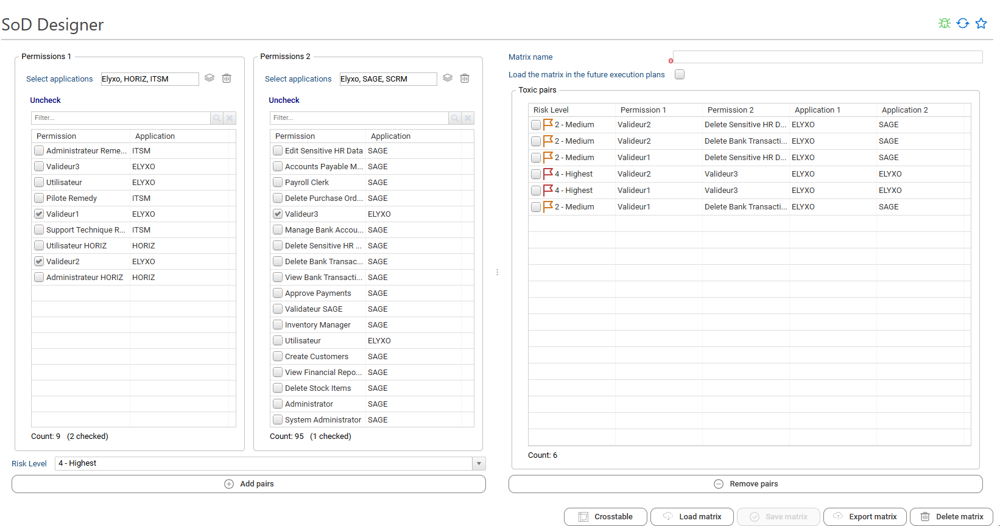

The matrix can be displayed as a cross table using the "Crosstable" button for a better overview.

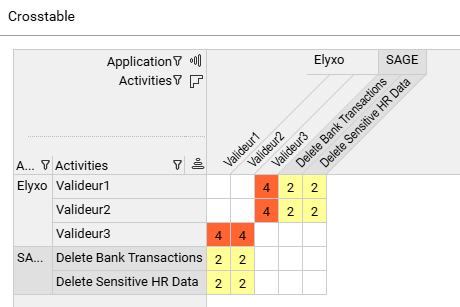

Once created, the toxic pairs can be saved in a matrix. A name must be entered in the text field in the top right.

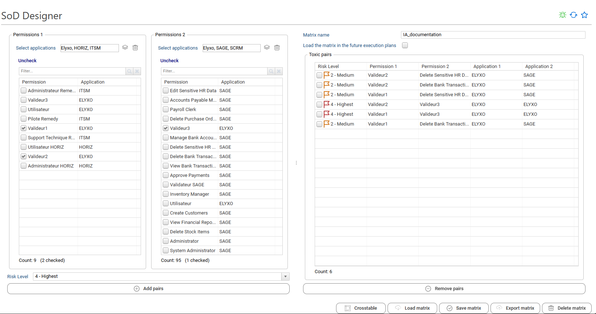

The "Save matrix" button can then be pressed to save everything that has been created.

### Load a matrix

There are two ways to load a matrix on the SoD Designer page, both available via the "Load matrix" button.

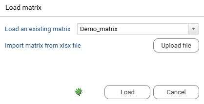

A matrix can be loaded either by selecting one that already exists in the environment, which will populate the page with the correct information, or by uploading an XLSX file exported from a matrix that follows a specific format. These exported matrix files can be retrieved using the "Export matrix" button, which is useful when a matrix has been configured in one environment and must be reused in another.

### Load a matrix

> [!Warning] The `bw_sod_designer` facet must be deployed in the project to load a matrix configured with the SoD Designer.

During matrix configuration, the `Load the matrix in the future execution plan` option can be checked before saving to include it in future execution plans.

The matrix can also be exported to an XLSX file that can be placed in a defined folder to load it into another environment.

### Delete a matrix

To delete a matrix, click "Delete matrix." A matrix must then be selected from the dialog that appears among the existing matrices in the environment, and the deletion must be confirmed.
