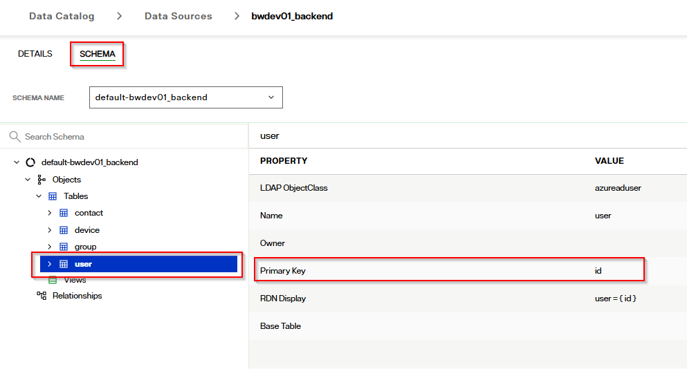
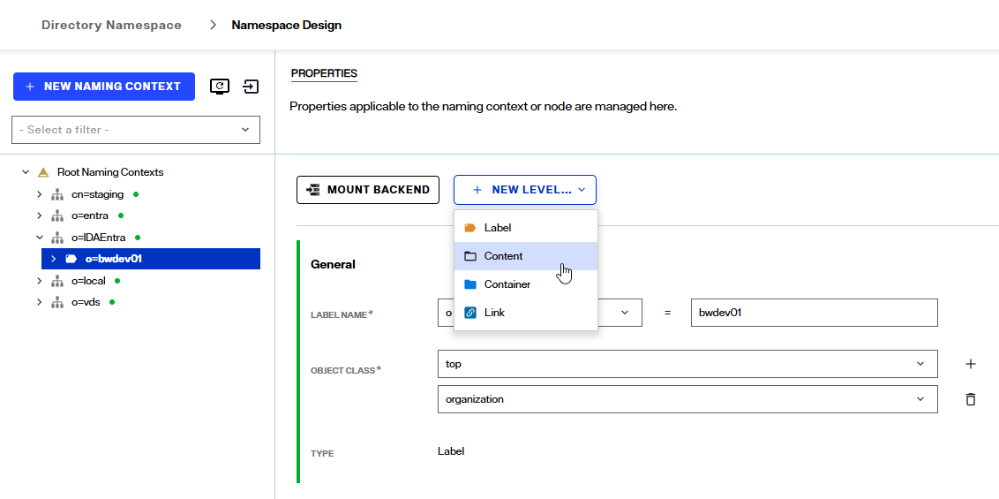
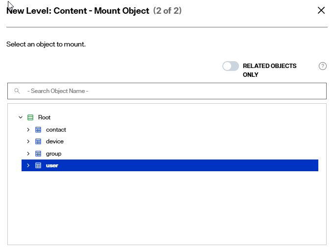
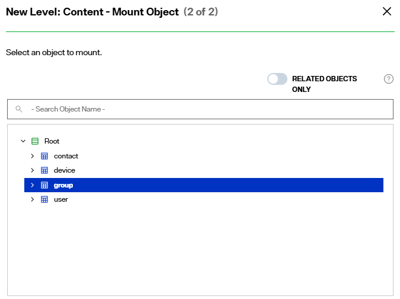
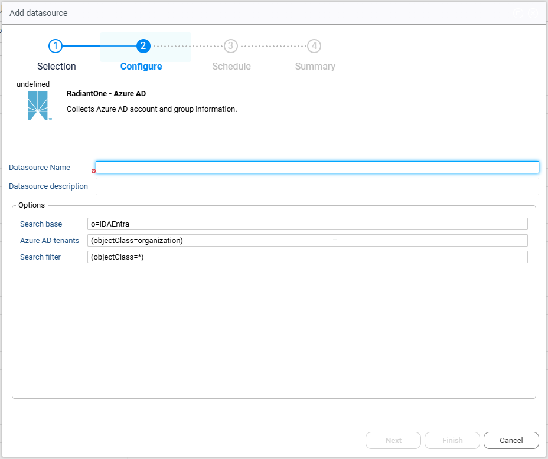

# Identity Data Management Integration

Radiant Logic offers two complementary products in the identity data space: Identity Data Management and Identity Analytics. This guide focuses on creating and configuring Views within Identity Data Management to streamline the integration of identity data into the Identity Analytics repository, requiring minimal configuration within the Identity Data Analytics platform itself.

Currently, Identity Data Management supports the following data sources for direct View integration with Identity Analytics:

Active Directory domains – Users and Groups

LDAP directories – Users and Groups

## Prerequisites

Identity Analytics requires data in Identity Data Management to be configured in a specific way to enable seamless extraction and collection. The following sections outline the necessary configuration steps for Active Directory and LDAP backends.

### Active Directory backend configuration

The Active Directory domain backend must be configured in the Identity Data Management control panel. To create the required hierarchy in Identity Data Management, follow these steps:  

- In the "Directory Namespace" tab, create a new naming context `o=IDAAD` based on a virtual tree.

- In the newly created root, create a level. The label type must be `dc`. Next, enter a name for the label.   

- Configure the mapping of the backend in the label. Select an LDAP backend mapping and point to the desired data source as the backend.  

- Remove the DN remapping option for all attributes.  

To validate the configuration, check that the directory browser has the following information:

- The label is correctly named `dc=XXXX`. 
- The attribute `objectClass=domain` is present for the label. 
- The users and groups are present.  

### Entra backend configuration

The connection to the Entra domain backend must be configured as an "Mgraph" type datasource in the "Data sources" tab of the "Data catalogue". Once the configuration is finalized, it is necessary to update the default schema used for the user configuration.
Change the primary key from UserPrincipalName to ID.

Once the backend and the schema are updated, navigate to the "Namespace Design" of the "Directory Namespace" to configure the namespace.

- Create a new level, such as o=IDAEntra, and assign the organization objectClass to that level.
- Select the `o=IDAEntra` entry and create a new label under it based on the name of the Entra tenant pulled, `o=bwdev01` in our example. Add the organization and domain objectClasses to the label.
- Select the `o=bwdev01` level and create a new content level.  

  - Select the configured datasource in the drop down list.
  - Select the datasource schema from the drop down list and click next.
  - Select the `user` object to mount. 
  
  - Navigate to the object build tab and add all necessary attributes (select all if in doubt)
- Select the `o=bwdev01` level and create a new content level.  

  - Select the configured datasource from the drop down list.
  - Select the datasource schema from the drop down list and click next.
  - Select the `group` object to mount.  
  
  - Navigate to the object build tab and add all necessary attributes (select all if in doubt).

Navigate to the directory browser page and select the `o=bwdev01` level under `o=IDAEntra` and validate the configuration.  

### LDAP backend configuration

The LDAP backend should have been configured in the Identity Data Management control panel. The configuration is similar to the configuration for the Active Domain backend. To create the required hierarchy in Identity Data Management, follow these steps:  

- In the "Directory Namespace" tab, create a new naming context `o=IDALDAP` based on a virtual tree.

- In the newly created root, create a label. The label type must be `dc`. Next, name the label.   

- Configure the mapping of the backend in the label. Select an LDAP backend mapping and point to the desired data source as the backend.  

- Remove the DN remapping option for all attributes.  

To validate the configuration, check that the directory browser has the following information:

- The label is correctly named `dc=XXXX`.  
- The attribute `objectClass=dcObject` is present for the label.  
- Users and groups are present.  

## Declaring the data source in Identity Analytics

In the Identity Analytics portal, expand the left menu and select the *Configure* option under the *Datasource Management* section.

This section displays a list of declared data sources. If none have been configured, the list will be empty. Click on the *Add* button to declare a new data source.

A wizard will launch to help you declare a new datasource, including default configurations for connecting to RadiantOne Identity Data Management: 

- RadiantOne - Active Directory  
- RadiantOne - Entra  
- RadiantOne - Generic LDAP  
- RadiantOne - Generic Bridge  

Each datasource requires a sightly different configuration. This is covered in the following sections.   

### RadiantOne - Active Directory

This connector is used when connecting to an Active directory backend in Identity Data Manager.  

Fill out the required fields. Example:

- Datasource name: o=IDAAD
- Datasource description: Extraction of all AD domains included in the root naming context of o=IDAAD

Options are configured by default and no modification is required. You can adjust your search filter to limit the data extraction.  

> If needed, you may change the parameters to correspond to your data structure in Identity Data Management. Note that the `dc` attribute is required.

Follow the steps shown in the wizard and complete them.  

### RadiantOne - Entra

This connector is used when connecting to an Entra backend through Identity Data Management. See [here](#entra-backend-configuration) for the required configuration of the namespace in Identity Data Management.  

Fill out the required fields. Example:

- Datasource Name: o=IDAEntra
- Datasource description: Extraction of all AD domains included in the root naming context of o=IDAEntra

Options are configured by default and no modification is required. You can adjust your search filter to limit the data extraction.  

> If needed, you may change the parameters to correspond to your data structure in Identity Data Management. Please keep in mind that the `dc` attribute is required.

Follow the steps shown in the wizard and complete them.  

### RadiantOne - Generic LDAP

This connector is used when connecting to a generic LDAP backend in Identity Data Management.  

Fill out the required fields. Example:

- Datasource Name: o=IDALDAP
- Datasource description: Extraction of all AD domains included in the root naming context of o=IDLDAP

Options are configured by default and no modification is required. You can adjust your search filter to limit the data extraction.  

> If needed, you may change the parameters to correspond to your data structure in Identity Data Management. Please keep in mind that the `dc` attribute is required.

Follow the wizard for the final steps.  

### RadiantOne - Generic Bridge

This connector is used as a bridge between Identity Data Management and Identity Analytics.

> This connector requires configuration of a dedicated collector line to leverage the input files.  

After clicking Next, provide the required information in order to connect to the Identity Data Management LDAP URL: 
- **LDAP Server URL**
- **Login**
- **Password**
- **Search base** used for the data extraction
- **Search filter** used to select the LDAP objects that will be extracted
- **Attributes** to extract, leave this empty to extract all available attributes  

Click Next to schedule the extraction. You can specify the data extraction schedule(for example, you can extract data once a week or every day).

Click Next to proceed to the final step of the wizard, then click Finish to confirm the datasource declaration.

## Declaring multiple Data sources

If you have multiple Identity Data Management URLs or different *Search Bases* to extract, you can repeat the process to declare one datasource by URL or by *Search Base*. Keep in mind that each datasource must have a unique datasource name.

## Testing the Data Extraction

Each declared datasource will have a corresponding connector created in the Controller.

You can reach the Controller using the URL `/controller`. Then click on the *Connectors* item in the menu that you will find on the left.

Click on the connector to see more details.

From here, you can use the *Submit a new test execution* button to trigger the data extraction process. This process takes a few minutes.

When the data extraction test process is complete, the details page will automatically refresh to display the test results.

You can download the test results to verify the extracted files.  

For more information on the controller, refer to the [Controller](../04-containers/controller.md) documentation.

