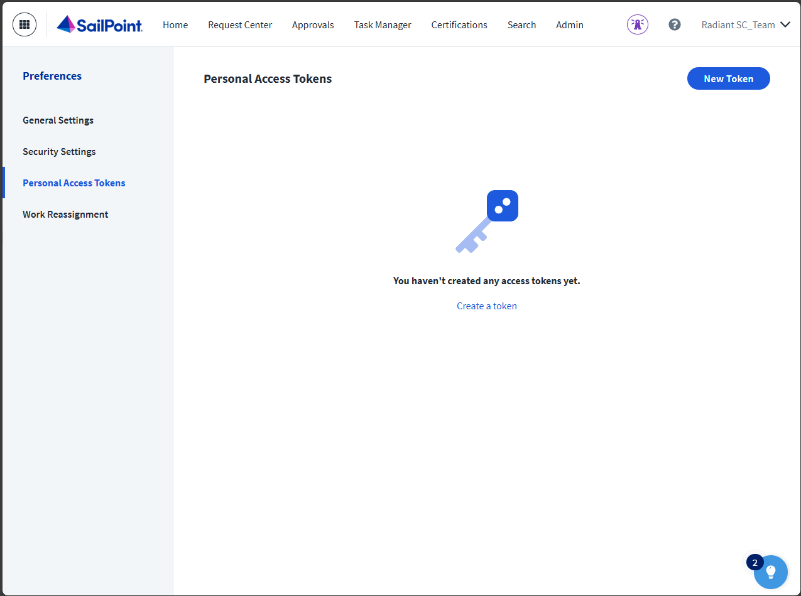
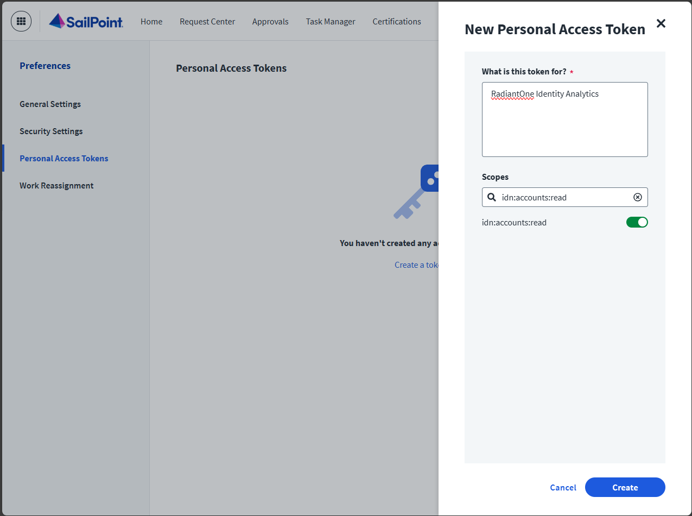
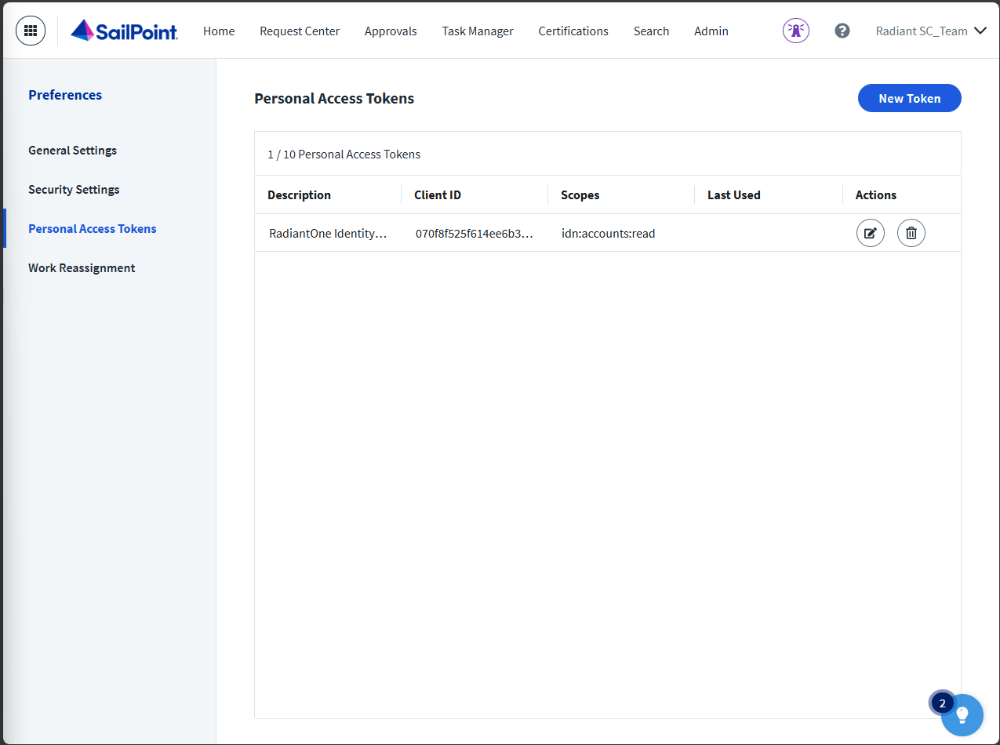
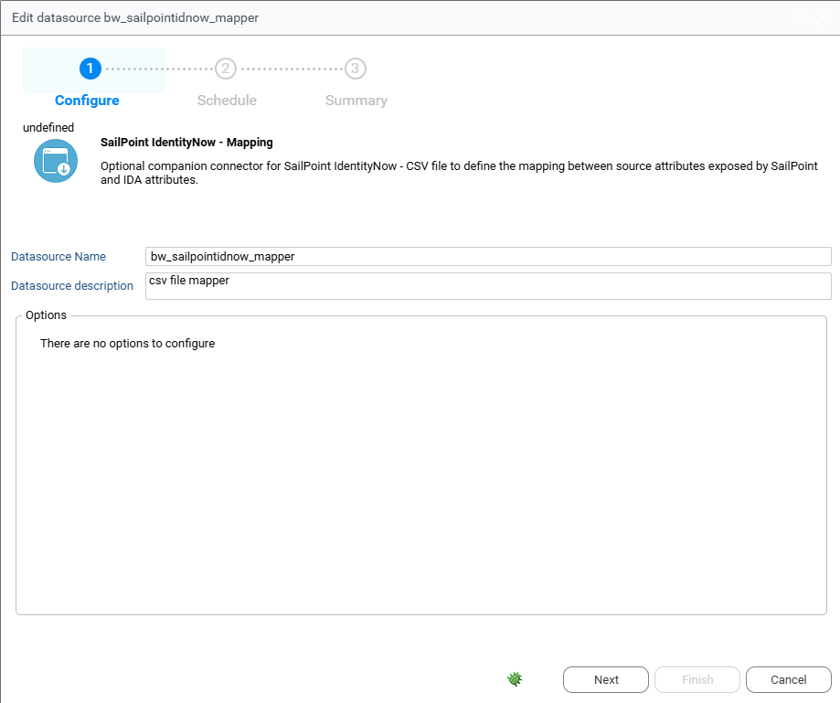

# Sailpoint Identity Now

## Introduction

This document provides instructions for integrating identity data from SailPointIdentityNow into Radiant Logic Identity Analytics. This extractor leverages SailPointIdentityNow v3 API.

## SailPointIdentityNow Configuration  

- Log into SailPointIdentityNow: Use an account with administrative privileges to access the instance.
- Navigate to your account preferences (drop down menu under your name) and Select "Personal Access Tokens" in the left menu.



- Click on "New token" to create a new access token
- Add a description such as "RadiantOne Identity Analytics"
- Select the following Oauth2 scopes:
  - `sp:scopes:default`
  - `idn:accounts:read`
  - `idn:role-unchecked:read`
  - `idn:access-profile:read`
  - `idn:sources:read`
  - `idn:entitlement:read`



- Save the Secret and the Client ID in a safe place and close the right panel




## Identity Analytics Portal Configuration

- SailPointIdentityNow is part of the Datasource Connectors. Connect to your Identity Analytics portal and navigate to the Datasource page.
- Create a new datasource: Select "SailPointIdentityNow" in the connector list and fulfill the following fields:  
  - tenant (it is located here in the URL https://**MYTENANT**.identitynow.com/)
  - clientid
  - secret

If you have an alternate SailPoint url such as https://MYTENANT.identitynow-demo.com/ you can set it by using the optional parameter "overriden url" with the value **identitynow-demo.com**

This extractor will load the following information in the ledger:  

- "SailPointIdentityNow" Repository and Application
- SailPointPublic Identities as "SailPointIdentityNow" accounts
- SailPointRoles as "SailPointIdentityNow" permissions with role type and groups (along with membership to "SailPointIdentityNow" accounts)
- SailPointaccounts as new Repository/Accounts (SourceName is used as a repository)
- SailPointAccess profiles and Entitlements as source application permissions with role type (along with Roles \> Access Profiles \> Entitlements and Roles \> Entitlements links)

## IdentityNow – Identity Analytics mapping configuration

Optionally you can configure the companion "SailPointIdentityNow – Mapping" datasource.



This allows you to load additional account data, specifically data under the "attributes" field in IdentityNow. This data generally is composed of source attributes exposed by the source, without any additional meaning necessarily attached to it.

To fit this information, we require a mapping file that associates source attributes with IDA data model attributes. This file is required to be a csv with the following header:

`source_id`,`source_name`,`source_attribute`,`ida_attribute`

- `source_id`: the SailPointIdentityNow internal unique identifier of the source from which this attribute comes.
- `source_name`: the name of the above-mentioned source.
- `source_attribute`: the name of the source attribute mapped, must exactly match the name as presented by the v3 API.
- `ida_attribute`: the code of the IDA attribute to map the source attribute to. You can find a full list of IDA account attributes at the end of this document.

Once the datasource is configured and the mapping file provided with a minimum of one line, you can activate the collection of source attributes by setting the bw_sailpointidnow_extendschema configuration variable to true.

Note that any mapped source attribute will take precedence over the SailPointIdentityNow default schema attribute, for example if "id" is mapped to clogin it will take over the default "name" attribute.

## Identity Analytics attributes

Here is a list of mappable Identity Analytics account attributes:

```txt
"cbadpasswordcount";"ccreatedate";"ccreateday";"ccustom1";"ccustom10";"ccustom11";"ccustom12";"ccustom13";"ccustom14";"ccustom15";"ccustom16";"ccustom17";"ccustom18";"ccustom19";"ccustom2";"ccustom20";"ccustom21";"ccustom22";"ccustom23";"ccustom24";"ccustom25";"ccustom26";"ccustom27";"ccustom28";"ccustom29";"ccustom3";"ccustom30";"ccustom31";"ccustom32";"ccustom33";"ccustom34";"ccustom35";"ccustom36";"ccustom37";"ccustom38";"ccustom39";"ccustom4";"ccustom5";"ccustom6";"ccustom7";"ccustom8";"ccustom9";"cdisabled";"cdontexpirepassword";"cemployeenumber";"cexpiredate";"cexpireday";"cflatgivenname";"cflatlogin";"cflatsurname";"cflatusername";"cgivenname";"cguid";"cidentifier";"clastlogindate";"clastloginday";"clastmodificationdate";"clastmodificationday";"clastmodifiedby";"clocked";"clogin";"clogincount";"cmail";"cmanagerdata";"cnextpwdchangedate";"cnextpwdchangeday";"cnoownercode";"cnoownerreason";"cnotnormalaccount";"cpasswordcantchange";"cpasswordexpired";"cpasswordlastsetdate";"cpasswordlastsetday";"cpasswordnotrequired";"cprivilegedaccount";"cprofile";"cservice";"csid";"csmartcardrequired";"csurname";"cusername"
```

For more information please visit: https://developer.radiantlogic.com/ia/descartes/igrc-platform/collector/04-components/target/#account-target
