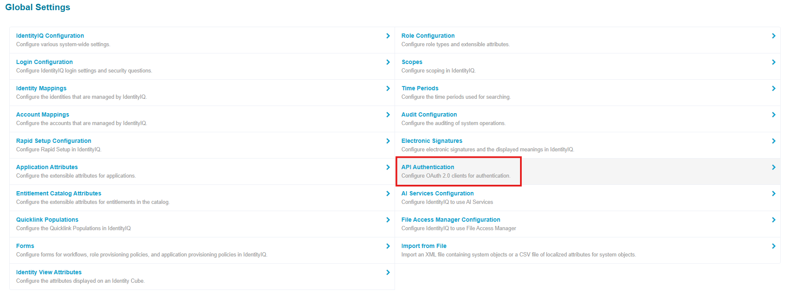
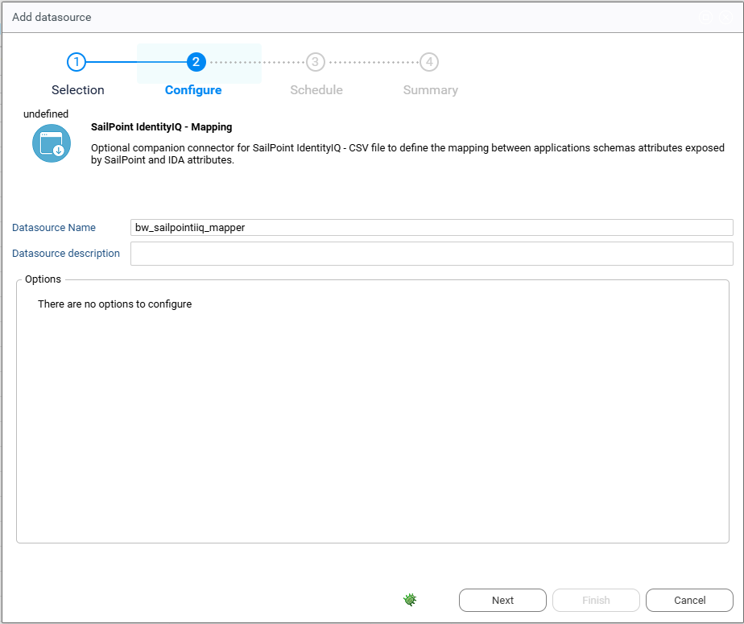

# Sailpoint Identity IIQ

## Introduction

This document provides instructions for integrating identity data from SailPoint IdentityIQ into Radiant Logic Identity Analytics. This extractor leverages SailPoint IdentityIQ SCIM API.

## SailPoint IdentityIQ Configuration

- Log into SailPoint IdentityIQ: Use an account with administrative privileges to access the instance.
- Navigate to "Global Settings" (drop down menu under the gear icon) and Select "API Authentication" in the list:



- Click on "Create" to create a new client, please note that this client needs a proxy user to "impersonate".

  - Add a client name such as "Radiant_integration" and choose the proxy user:


Please make sure that the
selected Proxy account has access to at list the entities behind the
following endpoints:

- `/Users`
- `/Accounts`
- `/Entitlements`
- `/Applications`
- `/Schemas`

If needed, you can edit or delete the client and generate a new secret using the buttons under the "Actions" column:


## Identity Analytics Portal Configuration

- SailPoint IdentityIQ is part of the Datasource Connectors. Connect to your Identity Analytics portal and navigate to the Datasource Management page.
- Create a new datasource: Select "Sailpoint IdentityIQ" in the connector list and fulfill the following fields:
  - Datasource Name: the name of this datasource (e.g `SailPoint_Prod_A`).
  - Datasource Description (optional): a description of this datasource.
  - Base SCIM API URL: The base URL of the SailPoint SCIM API, usually looks like `https://\<my_sailpoint\>/identityiq/scim/v2`
  - OAuth URL: The URL for OAuth authentication, usually looks like `https://\<my_sailpoint\>/identityiq/oauth2/token`. Please ensure that there are **no trailing slashes** ("/") in these URLs.
  - Client ID: The ID of the OAuth client you generated earlier.
  - Secret: The secret for the OAuth client you generated earlier.
  - Page size (optional): The "count" parameter in the SCIM request, determines the number of entries per response. Adjust depending on your specific needs and environment, making sure that the server is configured to accept higher values. Default if left empty is 1000.
  - Account query filter (optional): SCIM filter for the account extraction. For more information refer to: https://developer.sailpoint.com/docs/api/iiq/get-accounts
  - Entitlement query filter (optional): SCIM filter for the entitlement extraction. For more information refer to: https://developer.sailpoint.com/docs/api/iiq/get-entitlements
  - Application query filter (optional): SCIM filter for the application extraction. For more information refer to: https://developer.sailpoint.com/docs/api/iiq/get-applications
  - User query filter (optional): SCIM filter for the user extraction. For more information refer to: https://developer.sailpoint.com/docs/api/iiq/get-users

> Note: All these filters must follow the SCIM standard: https://datatracker.ietf.org/doc/html/rfc7644#section-3.4.2.2.

All these filters must be **consistent with each other**, with the following order of priority: Application \> Account \> Entitlement \> User. If you choose to exclude some applications from the application extraction, you must make sure these accounts are excluded from the account extraction etc. Filters to the user extraction have little to no incidence.

This extractor will load the following information in the ledger:

- SailPoint IdentityIQ Repositories and Applications.
- Accounts loaded into SailPoint as accounts from their respective application/repository.
- Entitlements loaded as such into SailPoint as permissions from their respective application.
- Accesses of accounts to entitlements loaded as such and present in their schemas as rights to these entitlements.

User data is extracted by default but not loaded, this data can be used
to fulfil the "Identity" entity of the Ledger. Schemas are extracted to
help build the mapping file described later in this document.

## IdentityIQ – Identity Analytics mapping configuration

Optionally you can configure the companion "SailPoint IdentityIQ –
Mapping" datasource.



This allows you to load additional account data, specifically data under the specific schemas field in IdentityIQ. This data generally is composed of source attributes exposed by the application, without any additional meaning necessarily attached to it.

To fit this information, we require a mapping file that associates application schemas attributes with IDA data model attributes. This file is required to be a csv with the following header:

`source_id`,`source_name`,`source_attribute`,`ida_attribute`

- `app_id`: the SailPoint IdentityIQ internal unique identifier of the application from which this attribute comes.
- `app_name`: the name of the above-mentioned application.
- `schema_attribute`: the name of the application schema attribute mapped, must exactly match the name as presented by the SCIM API.
- `ida_attribute`: the code of the IDA attribute to map the source attribute to. You can find a full list of IDA account attributes at the end of this document.

Once the datasource is configured and the mapping file provided with a minimum of one line, you can activate the collection of source attributes by setting the `bw_sailpointiiq_extendschema` configuration variable to true.

Note that any mapped source attribute will take precedence over the SailPoint IdentityIQ default schema attribute, for example if "id" is mapped to clogin it will take over the default "displayname" attribute.

## Identity Analytics attributes

Here is a list of mappable Identity Analytics account attributes:

```txt
"cbadpasswordcount";"ccreatedate";"ccreateday";"ccustom1";"ccustom10";"ccustom11";"ccustom12";"ccustom13";"ccustom14";"ccustom15";"ccustom16";"ccustom17";"ccustom18";"ccustom19";"ccustom2";"ccustom20";"ccustom21";"ccustom22";"ccustom23";"ccustom24";"ccustom25";"ccustom26";"ccustom27";"ccustom28";"ccustom29";"ccustom3";"ccustom30";"ccustom31";"ccustom32";"ccustom33";"ccustom34";"ccustom35";"ccustom36";"ccustom37";"ccustom38";"ccustom39";"ccustom4";"ccustom5";"ccustom6";"ccustom7";"ccustom8";"ccustom9";"cdisabled";"cdontexpirepassword";"cemployeenumber";"cexpiredate";"cexpireday";"cflatgivenname";"cflatlogin";"cflatsurname";"cflatusername";"cgivenname";"cguid";"cidentifier";"clastlogindate";"clastloginday";"clastmodificationdate";"clastmodificationday";"clastmodifiedby";"clocked";"clogin";"clogincount";"cmail";"cmanagerdata";"cnextpwdchangedate";"cnextpwdchangeday";"cnoownercode";"cnoownerreason";"cnotnormalaccount";"cpasswordcantchange";"cpasswordexpired";"cpasswordlastsetdate";"cpasswordlastsetday";"cpasswordnotrequired";"cprivilegedaccount";"cprofile";"cservice";"csid";"csmartcardrequired";"csurname";"cusername"
```

For more information please visit: https://developer.radiantlogic.com/ia/descartes/igrc-platform/collector/04-components/target/#account-target
